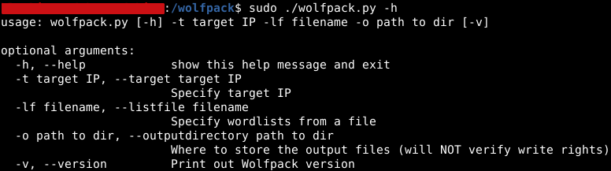

# Wolfpack v0.1.0 (Early)
## A small cluster of Docker containers, utilizing various tools for scanning websites and web apps to find potential attack vectors.
---

**WARNING:** Use ONLY on web apps you have the proper permission to scan. The creator of Wolfpack bears ABSOLUTELY NO RESPONSIBILITY for unauthorized misuse.

---
### Author's notes

If someone finds this repository by chance, please know:

I initially created this tool as a University assignment. No misuse of the used tools was intended. I plan to expand this further in the future, since I enjoyed it's creation process, but until then, know that the tool "Wolfpack" is no more than "the passion project of a hacker-in-the-making that loves all things cloud".

That said, please feel free to message me and/or expand this yourselves if you can contribute in any way.

---

### Scanners used
- [Nmap](https://github.com/nmap/nmap) - for port and vulnerability scanning
- [Wfuzz](https://github.com/xmendez/wfuzz) - for directory scanning
- [Ffuf](https://github.com/ffuf/ffuf) - for subdomain scanning
- (Probably more later)
---

### Install prerequisites
- Docker Engine (refer to [the official docs](https://docs.docker.com/engine/install/) for installation instructions)
- Python 3 (I used 3.8 for the creation of this verion and test-ran it for as low as 3.5, but any 3.x should work in theory)

---
### Install
To install, simply:
```sh
git clone https://github.com/BlackICE-Zed/wolfpack.git
```

...and move everything to the directory of your choice

**IMPORTANT:** DO NOT change the directory structure of the tool!
It is not designed to be altered. Even the names of the directories MUST stay as is.

Optionally, you can freely either run the executable, or create a link of your choice. Do keep in mind the execute privileges.

---
### Usage
**NOTICE:** Sudo is required to run.


Here's an example command:
```bash
sudo ./wolfpack.py -t 13.3.7.42 -lf /random/path/list_file.txt -o /another/random/path/out_dir
```

A list file will be given with the template (tool_name=/absolute/path/to/wordlist). Enter the absolute paths of the wordlists that you need to be used (whitespaces on tail ends will be stripped) and hit save and exit. The name of the file can be changed but the template cannot.

Substitute with the IP, name of the list file and output directory (either relative or absolute path) you need to run with and hit ENTER.

**NOTICE:** Keep in mind that the "seclists" package will be installed on the containers. This means that if you pass as an argument the absolute path of a seclist, the tool will find it and use it.

A confirmation message with your parameters will pop up. If you spot a mistake, CANCEL and correct it. Otherwise, hit ENTER and go grab a coffee, as the tool will take its time.

---

### What will happen
The wolfpack.py that you invoke is a "control script".

Post-confirmation, the script will build and run a Docker container running Nmap with the IP that you gave to scan.

You will have real-time feedback of the scan progress and results.

After the scan, the output files (all 3 formats) will be output and copied to your machine, on the output directory of your selection. Then, the container will be removed from your machine.

The exact same procedure will take place with another Docker container running wfuzz.

If a host is successfully resolved, after the wfuzz scan a third and final scan for subdomains with ffuf will take place.

After all 3 containers have been spawned, scanned and removed, the tool will exit.

---

### Known issues & Troubleshooting

Being in its VERY early stages, this tool is vastly imperfect.

- The reason the seclists are downloaded separately for each container and not simply mounted from the host is that the mount method was problematic. The installation will take about 3-4 minutes. Until I fix this in the future, patience is required.
- If a scan needs to be cancelled half-way, the user can simply CTRL + C (KeyboardInterrrupt). Docker will gracefully terminate the containers, but sometimes it doesn't and the next runs of Wolfpack raise errors. If this is the case, either remove the containers by hand (as they simply remain as "ghosts" - very rare during testing) or clear Docker's cache.
- The ffuf container, very rarely, fails to install its requirements and raises an error. It seems to be another problem with Docker's cache but this is uncertain. Try clearing Docker's cache again if it happens.